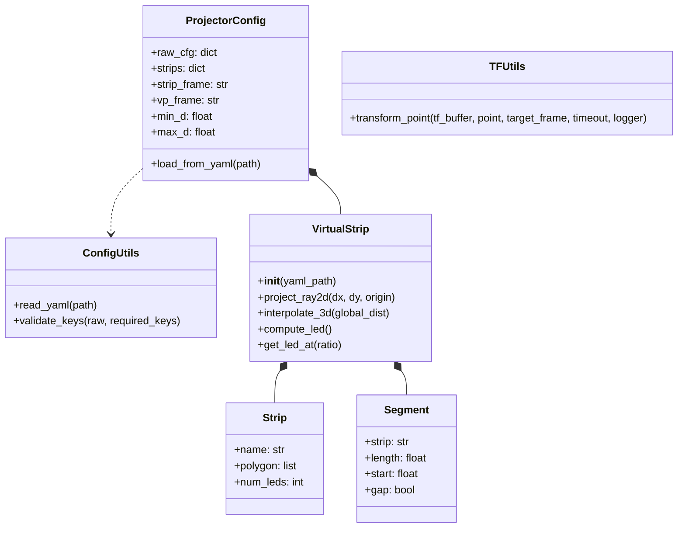

# led\_strip\_hmi\_common

## Overview

The **led\_strip\_hmi\_common** package provides core utilities and data structures for LED strip configuration, coordinate transforms, and virtual strip geometry. Unlike other packages, it contains no ROS nodes—only Python modules suitable for import in other packages.

Modules:

* `config.py`: Defines `ProjectorConfig` to load and validate strip definitions from YAML.
* `config_utils.py`: Helper functions for parsing and validating YAML configs.
* `tf_utils.py`: Utility functions for working with TF transforms (static and dynamic).
* `virtual_strip.py`: Implements `VirtualStrip` and related classes for LED indexing and geometry.

## Features

* 📄 **Config management**: Load, validate, and query strip definitions with zero dependencies on ROS.
* ⚙️ **Modular utilities**: Standalone helpers for YAML parsing, error-checking, and coordinate transforms.
* 🎛️ **Virtual strip abstraction**: Compute per-segment LED positions, map distances to LED indices, and handle arbitrary segmentations.

## Dependencies

* Python 3.8+
* `PyYAML`
* `numpy`
* **(Optional)** `tf2_ros` when used in ROS nodes.

## Installation & Build

Typically installed as part of the workspace:

```bash
cd ws_led_strip_hmi
colcon build --packages-select led_strip_hmi_common
source install/setup.bash
```

If developing locally, install requirements:

```bash
pip install -r src/led_strip_hmi_common/requirements.txt
```

## Usage

Import modules in your Python code:

```python
from led_strip_hmi_common.config import ProjectorConfig
from led_strip_hmi_common.virtual_strip import VirtualStrip

# Load config
cfg = ProjectorConfig.load_from_yaml('path/to/strips.yaml')

# Access virtual strips
vs = cfg.virtual_strips[0]
led_positions = vs.get_led_positions()

# Map a point along the strip to an index
detection_point = (x, y, z)
strip_id, led_idx = vs.map_point_to_led(detection_point)
```

## Parameters

This library has no ROS parameters.

## Topics

This library does not subscribe or publish any ROS topics.

## Architecture & UML

The following UML class diagram depicts the core classes and their relationships in **led\_strip\_hmi\_common**, using standard UML notation:



## Testing

```bash
colcon test --packages-select led_strip_hmi_common
colcon test-result --verbose
```

## Contributing

1. Fork the repository and create a feature branch.
2. Write unit tests for new functionality.
3. Ensure linting and tests pass (`./test_single_pkg.sh`).
4. Submit a Merge Request.

## License

See [LICENSE](../LICENSE) for details.
