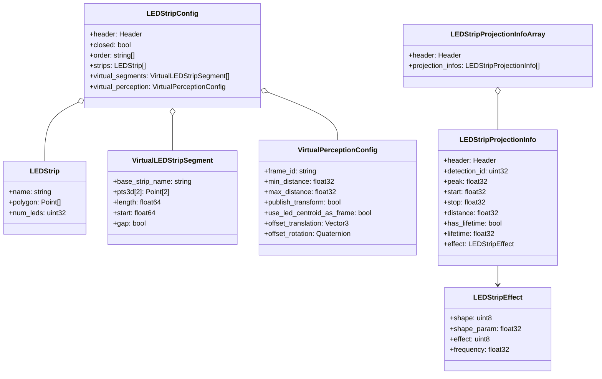

# led\_strip\_hmi\_msgs

## Overview

The **led\_strip\_hmi\_msgs** package defines custom ROS 2 messages for configuring and driving virtual LED strips, as well as publishing projection results and effects.

It provides:

* **LEDStripConfig**: Complete workspace-level configuration of LED strips, including physical layouts and virtual perception parameters.
* **LEDStripProjectionInfoArray**: Results of projecting detections onto the virtual strip, with per-detection normalized indices and optional effects.
* **Auxiliary types**: LEDStrip, VirtualLEDStripSegment, VirtualPerceptionConfig, LEDStripEffect, LEDStripProjectionInfo.

## Message Definitions

### LEDStrip.msg

```ros
string name
geometry_msgs/Point[] polygon    # 3D points defining the strip shape
uint32 num_leds                  # Number of LEDs along the strip
```

### VirtualLEDStripSegment.msg

```ros
string base_strip_name
geometry_msgs/Point[2] pts3d      # Two 3D points defining segment endpoints
float64 length
float64 start
bool gap                          # True if this segment is a gap between strips
```

### VirtualPerceptionConfig.msg

```ros
string frame_id
float32 min_distance
float32 max_distance
bool publish_transform
bool use_led_centroid_as_frame
geometry_msgs/Vector3 offset_translation
geometry_msgs/Quaternion offset_rotation
```

### LEDStripConfig.msg

```ros
std_msgs/Header header
bool closed                     # Whether the strips form a closed loop
string[] order                  # Names of strips in iteration order
LEDStrip[] strips               # Physical strip definitions
VirtualLEDStripSegment[] virtual_segments
VirtualPerceptionConfig virtual_perception
```

### LEDStripEffect.msg

```ros
# Shape enums
typedef uint8 SHAPE_GAUSSIAN=0
typedef uint8 SHAPE_RECTANGLE=1
typedef uint8 SHAPE_TRIANGLE=2
uint8 shape
float32 shape_param             # e.g. variance or half-width

# Effect enums
typedef uint8 EFFECT_NONE=0
typedef uint8 EFFECT_WAVE=1
typedef uint8 EFFECT_PULSE=2
uint8 effect
float32 frequency               # Hz for wave/pulse
```

### LEDStripProjectionInfo.msg

```ros
std_msgs/Header header
uint32 detection_id
float32 peak
float32 start
float32 stop
float32 distance
bool    has_lifetime
float32 lifetime
LEDStripEffect effect
```

### LEDStripProjectionInfoArray.msg

```ros
std_msgs/Header header
LEDStripProjectionInfo[] projection_infos
```

## Dependencies

* `std_msgs`
* `geometry_msgs`
* `visualization_msgs` (for potential MarkerArray interoperability)
* `sensor_msgs` (for compatibility in projection workflows)

## Installation & Build

From your workspace root:

```bash
rosdep update && \
  rosdep install --from-paths src --ignore-src -r -y
colcon build --packages-select led_strip_hmi_msgs
source install/setup.bash
```

## Usage

Once built, iterate on interfaces or inspect them:

```bash
ros2 interface show led_strip_hmi_msgs/msg/LEDStripConfig
ros2 interface show led_strip_hmi_msgs/msg/LEDStripProjectionInfoArray
```

Import in Python or C++:

```python
from led_strip_hmi_msgs.msg import LEDStripConfig, LEDStripProjectionInfoArray
```

## Architecture & UML

The class diagram below illustrates message types and their relationships:



## Contributing

1. Propose or update message fields with clear rationale.
2. Follow ROS 2 msgs styling conventions.
3. Run `ros2 interface show` to validate changes.
4. Submit a Merge Request.

## License

See [LICENSE](../LICENSE) for details.
