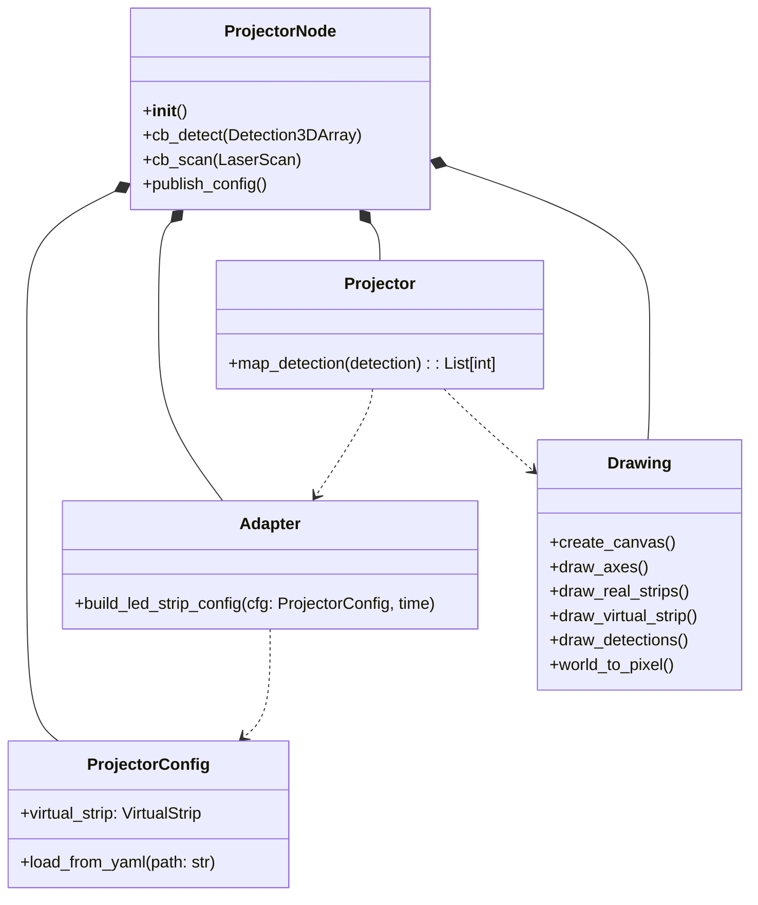

# led\_strip\_hmi\_projector

## Overview

The **led\_strip\_hmi\_projector** package projects 3D detections (e.g., human poses or LaserScan returns) onto a configurable virtual LED strip layout. It publishes:

* **LED strip configuration** (`LEDStripConfig`) as a latched, transient-local message.
* **LED indices** (`LEDStripProjectionInfoArray`) indicating which LEDs should light up per detection.
* **Debug image** (`sensor_msgs/Image`) showing the strips, detections, and projection overlay.

Under the hood, it:

1. Loads strip definitions from a YAML file into `ProjectorConfig`.
2. Builds a `VirtualStrip` for normalized indexing.
3. Transforms and projects detections via `map_detection`.
4. Draws overlays with OpenCV utilities in `drawing.py`.
5. Handles ROS subscriptions/publications in `ProjectorNode`.

## Features

* 🎛️ **Configurable layouts**: Define arbitrary strip shapes, densities, and frames in YAML.
* 🔄 **Multi-input support**: Subscribe to `Detection3DArray` or `LaserScan`.
* 🖼️ **Debug visualization**: Publish an OpenCV image of the projection for easy troubleshooting.
* 🔗 **ROS2-native**: Uses `rclpy`, `tf2_ros`, and standard QoS settings.

## Dependencies

* ROS 2 (Foxy or later)
* `rclpy`, `tf2_ros`, `ament_index_python`
* `cv_bridge`, `sensor_msgs`, `vision_msgs`, `geometry_msgs`
* `numpy`, `opencv-python` (installed via ROS packages)
* **led\_strip\_hmi\_common**
* **led\_strip\_hmi\_msgs**

## Installation & Build

From your workspace root (`ws_led_strip_hmi`):

```bash
# Ensure dependencies are installed
rosdep update && \
  rosdep install --from-paths src --ignore-src -r -y

# Build only this package (or omit --packages-select to build all)
colcon build --packages-select led_strip_hmi_projector

source install/setup.bash
```

## Usage

### Direct invocation

```bash
ros2 run led_strip_hmi_projector projector_node \
  --ros-args \
  -p strips_config:=/path/to/strips.yaml
```

### Via launch file

Use one of the demo launch files (e.g., in **led\_strip\_hmi\_demos**):

```bash
ros2 launch led_strip_hmi_demos caripu.launch.py
```

## Parameters

| Parameter       | Type   | Default                                                  | Description                         |
| --------------- | ------ | -------------------------------------------------------- | ----------------------------------- |
| `strips_config` | string | `$(find led_strip_hmi_visualization)/config/strips.yaml` | Path to the strips YAML definition. |

## Topics

### Subscribed

| Topic                  | Type                           | Description                                   |
| ---------------------- | ------------------------------ | --------------------------------------------- |
| `/detection_vision_3d` | `vision_msgs/Detection3DArray` | 3D detection poses to project                 |
| `/scan`                | `sensor_msgs/LaserScan`        | Optional LaserScan input                      |
| TF frames              | —                              | Transforms between `strip_frame` & `vp_frame` |

### Published

| Topic               | Type                                             | QoS & Description                        |
| ------------------- | ------------------------------------------------ | ---------------------------------------- |
| `/led_strip_config` | `led_strip_hmi_msgs/LEDStripConfig`              | Transient-local (latched) config message |
| `/led_indices`      | `led_strip_hmi_msgs/LEDStripProjectionInfoArray` | LED indices per strip                    |
| `/debug_image`      | `sensor_msgs/Image`                              | OpenCV image with overlay                |

## Architecture & UML

The following class diagram shows the key modules and their relationships using standard UML notation:



## Testing

```bash
# Run all tests for this package
colcon test --packages-select led_strip_hmi_projector

# Check code style and docstrings
colcon test-result --verbose
```

## Contributing

Please follow the guidelines in the workspace root:

1. Create an issue or feature request.
2. Fork & branch (`git checkout -b feature/foo`).
3. Ensure all tests pass (`./test_single_pkg.sh`).
4. Submit a Merge Request with clear description.

## License

This project is licensed under the **MIT License**. See the [LICENSE](../../../LICENSE) file for details.
