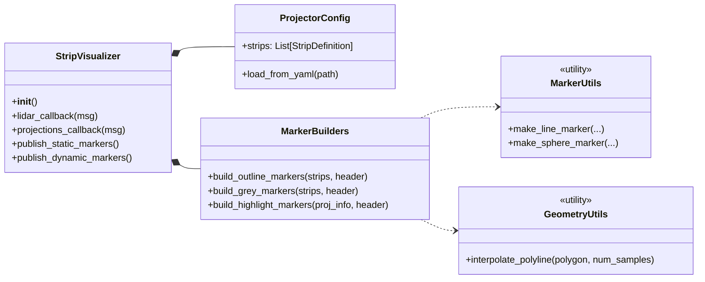

# led\_strip\_hmi\_visualization

## Overview

The **led\_strip\_hmi\_visualization** package visualizes virtual LED strips in RViz by rendering:

* **Static outlines** of each strip polygon.
* **Grey markers** for unlit LEDs.
* **Colored markers** highlighting active LEDs based on projection info.

It subscribes to:

* **LEDStripConfig** (`led_strip_hmi_msgs/LEDStripConfig`) for strip geometry.
* **LEDStripProjectionInfoArray** (`led_strip_hmi_msgs/LEDStripProjectionInfoArray`) for which LEDs to highlight.

It publishes:

* **MarkerArray** (`visualization_msgs/MarkerArray`) for RViz rendering.

## Features

* 🎛️ **Configurable strips**: Supports any number of strips defined in YAML.
* 🔄 **Dynamic updates**: Listens to projection arrays to update highlights in real-time.
* 🌐 **Frame-aware**: Uses ROS TF to place strips in the correct coordinate frames.

## Dependencies

* ROS 2 (Foxy or later)
* `rclpy`, `tf2_ros`, `ament_index_python`
* `visualization_msgs`, `std_msgs`
* `numpy`
* **led\_strip\_hmi\_common**
* **led\_strip\_hmi\_msgs**

## Installation & Build

```bash
cd ws_led_strip_hmi
rosdep update && rosdep install --from-paths src --ignore-src -r -y
colcon build --packages-select led_strip_hmi_visualization
source install/setup.bash
```

## Usage

```bash
ros2 run led_strip_hmi_visualization strip_visualizer \
  --ros-args -p strips_config:=/path/to/strips.yaml
```

Or include it in a demo launch:

```bash
ros2 launch led_strip_hmi_demos laserscan.launch.py
```

## Parameters

| Parameter       | Type   | Default                                                  | Description                         |
| --------------- | ------ | -------------------------------------------------------- | ----------------------------------- |
| `strips_config` | string | `$(find led_strip_hmi_visualization)/config/strips.yaml` | Path to LED strip definitions YAML. |

## Topics

### Subscribed

| Topic               | Type                                             | Description                      |
| ------------------- | ------------------------------------------------ | -------------------------------- |
| `/led_strip_config` | `led_strip_hmi_msgs/LEDStripConfig`              | Strip geometry definitions.      |
| `/led_indices`      | `led_strip_hmi_msgs/LEDStripProjectionInfoArray` | Active LED indices per strip.    |
| TF frames           | —                                                | ROS transforms for strip frames. |

### Published

| Topic                         | Type                             | Description                     |
| ----------------------------- | -------------------------------- | ------------------------------- |
| `/visualization_marker_array` | `visualization_msgs/MarkerArray` | Markers for RViz visualization. |

## Architecture & UML

Below is a class/module diagram illustrating the relationships between core components using standard UML notation:



## Testing

```bash
colcon test --packages-select led_strip_hmi_visualization
colcon test-result --verbose
```

## Contributing

Follow the workspace guidelines:

1. Issue → Fork → Branch.
2. Implement and add tests.
3. Ensure linting (`flake8`, `pytest`) passes.
4. Submit a Merge Request.

## License

See [LICENSE](../LICENSE) for details.
